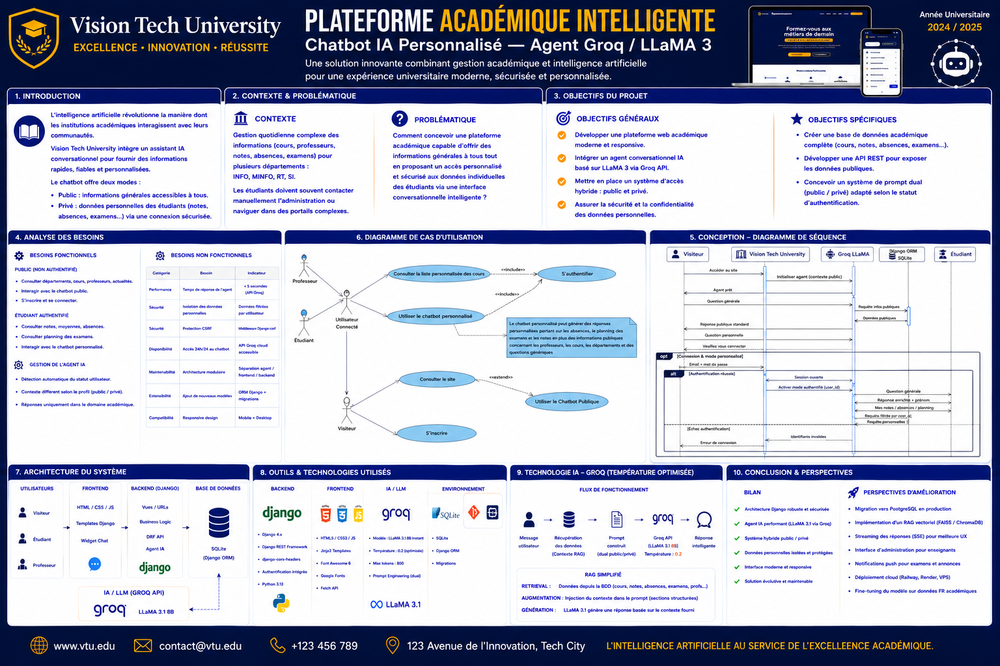

# AI University Management System


University management platform featuring an AI-powered chatbot, REST APIs, and role-based dashboards for students, professors, and administrators.

## Features

* AI chatbot powered by Groq / LLaMA 3
* Student dashboard
* Professor dashboard
* Administrator dashboard
* Authentication system
* REST APIs
* Academic management (courses, grades, absences, exams)

## Technologies

* Python
* Django
* Django REST Framework
* JavaScript
* HTML/CSS
* SQLite
* Groq API
* LLaMA 3

## Architecture

* Frontend (HTML/CSS/JavaScript)
* Backend (Django)
* REST APIs
* AI Agent Layer
* Database Layer

## Installation

```bash
pip install -r requirements.txt
cd backend
python manage.py migrate
python manage.py seed_db
python manage.py runserver
```

## Future Improvements

* PostgreSQL deployment
* Cloud hosting
* RAG architecture
* Advanced analytics
